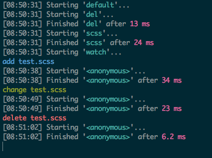

# 监听文件变化 (删除不需要的文件, 利用 chalk 打印出漂亮的相关信息)

## 简要介绍

一般在开发过程中, 需要先 build, 在 watch, 目的当然是做到可以监听文件变化以减少 build 的时间啦.

并且在监听文件的同时, 希望在 terminal 打印出相关信息 (增删改)


## 相关插件(模块)

+ [gulp-sass](https://github.com/dlmanning/gulp-sass)
+ [chalk](https://github.com/chalk/chalk) - Terminal string styling done right (漂亮的输出)
+ [del](https://github.com/sindresorhus/del) - 删除文件
+ path - 内置模块, 计算文件路径

## 使用说明

在 `watch/` 目录下, 运行 `gulp` , 新增 `test.scss`, 注意观察 `build` 目录;

然后在 `test.scss` 中修改内容;

然后删除 `test.scss`.

注意 terminal



## 代码分析

```javascript
var watcher = gulp.watch(config.scssPath, gulp.task('scss'));
watcher.on('add', (filePath) => console.log(chalk.blue('add', filePath)));
watcher.on('change', (filePath) => console.log(chalk.green('change', filePath)));
watcher.on('unlink', (filePath) => {
    console.log(chalk.red('delete', filePath));
    var src = path.relative(path.resolve('.'), filePath);
    src = src.replace(/.scss$/, '.css');
    var dest = path.resolve(config.buildDir, src);
    return del(dest);
});
```

第一行表示 `gulp` 监听 `config.scssPath` 表示的文件, 文件变化, 则执行 `scss` 任务.

同时返回一个监听句柄 `watcher`, `watcher` 可以在 文件增(`on`), 改(`change`), 删(`unlink`) 事件上注册响应事件.

对于 `add`, `change` 事件, 笔者没有做特殊处理, 仅仅是打印出来相关信息, 这里用到了 `chalk` 的 API, 可以使打印效果更好.

在 `unlink` 事件中, 这里 `filePath` 即被删除的文件路径, 这里笔者计算了被删除文件相对于当前文件的相对路径, 然后计算了在 `build` 目录下对应的生成路径, 然后将其删除.

至于为什么这么做, 因为如果项目复杂, 我们可能采取工具将生成的文件注入到 `index.html` 中, 所以对于删除的文件, 如果不及时删除 `build` 下的文件的话, 很有可能会引用一个并不需要的文件.


## 其他

另外, 可以在 build 阶段, 引入 [`plumber`](../plumber) 哦, 以免 watch 的时候因为语法错误不得不重新启动 gulp